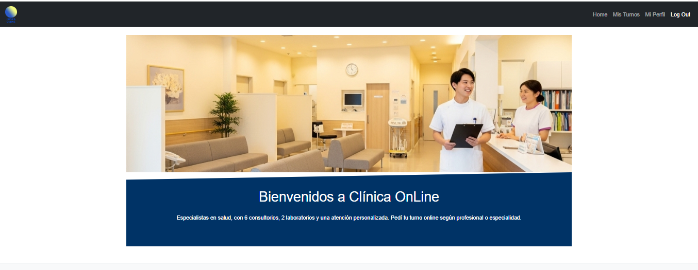
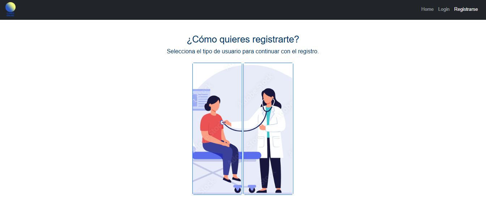
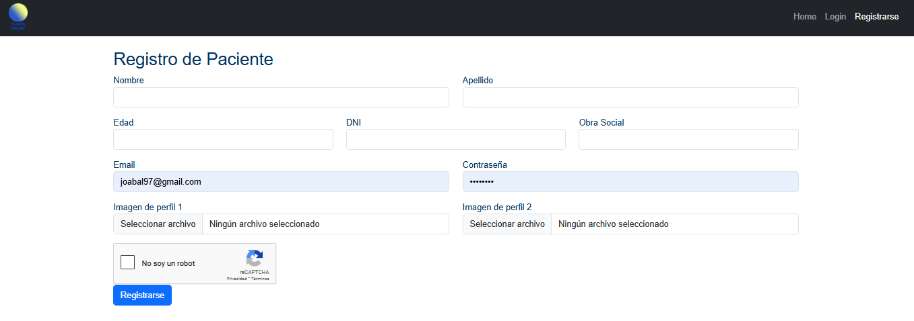
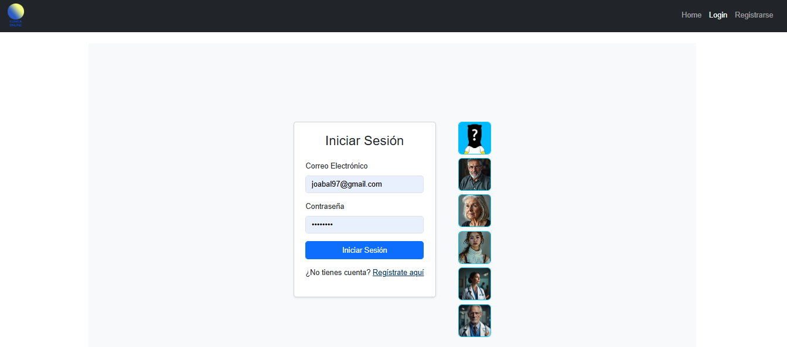
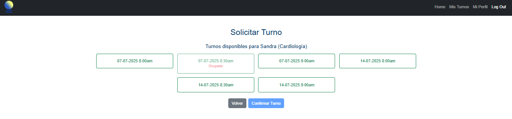
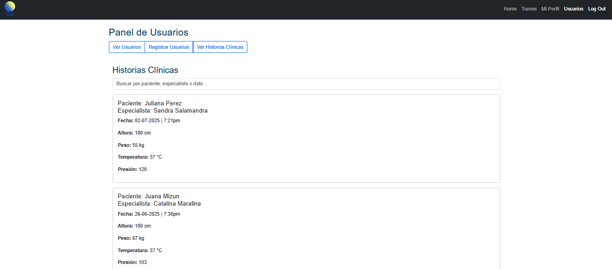
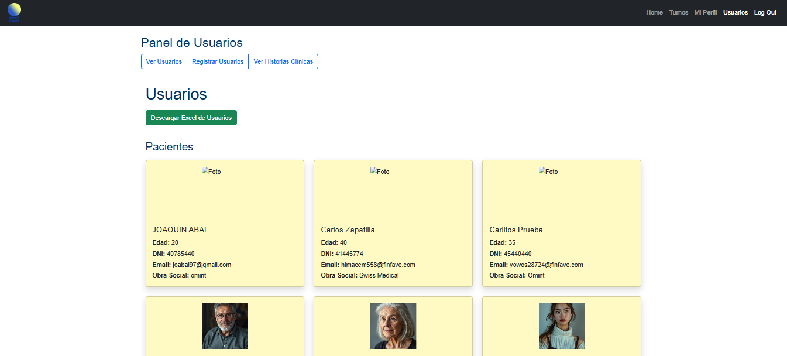

# Clínica Online

Portal de gestión de clínica médica desarrollado en **Angular** y **Supabase** como backend.

---

## 🚀 Descripción

Este proyecto simula el portal web de una clínica, permitiendo a pacientes, especialistas y administradores gestionar turnos, usuarios, perfiles y otras funcionalidades relacionadas a una clínica moderna.

Incluye autenticación, manejo de roles, registro de usuarios, gestión de turnos, carga de imágenes, filtros, validaciones y más.

---

## 🖥️ Tecnologías usadas

- **Angular** 17+
- **Supabase** (auth, database y storage)
- **Bootstrap** (para diseño responsive)
- TypeScript

---

## 📸 Screenshots

- **HOME**

- **REGISTROS**

- **LOGIN**

- **Mi Perfil - Pacientes**

- **Solicitar Turno**

- **Ver Historias Clínicas**

- **Ver Usuarios**

## ⚙️ Funcionalidades principales

- **Registro y login de usuarios** (Paciente, Especialista, Administrador)
- **Gestión de turnos** con distintas vistas y filtros por rol
- **Panel de administración** para habilitar usuarios y gestionar especialidades
- **Carga y validación de imágenes de perfil**
- **Encuestas, reseñas y calificaciones**
- **Pantalla de perfil personal y horarios**

---

## 📄 Licencia

Este proyecto se distribuye bajo licencia [MIT](LICENSE).

---

> Proyecto realizado para la materia **Laboratorio de Computación IV** en **UTN - Avellaneda**

